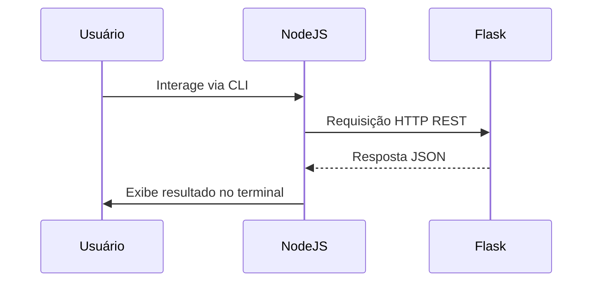

# Projeto de Comunicação entre Flask e Node.js

## Descrição

Este projeto consiste em duas aplicações distintas que se comunicam via API REST:

- **Backend (Flask/Python):** Fornece API RESTful para autenticação, verificação de plágio e armazenamento dos dados.  
- **Cliente (Node.js):** Interface de linha de comando (CLI) que consome a API Flask para login, cadastro e verificação de plágio.

O Node.js não executa código Python diretamente; ele solicita que o Flask execute as operações e retorne os resultados.

---

## Requisitos

- Node.js instalado  
- Python com Flask e dependências instaladas  
- Backend Flask rodando localmente em `http://localhost:3000`

---

## Como Rodar

### Backend Flask

1. Configure e execute o servidor Flask na porta 3000.  
2. Verifique se as rotas `/login`, `/usuarios` e `/plagio` estão funcionando.

### Cliente Node.js

1. Navegue até a pasta do projeto Node.js.  
2. Execute o comando:

```bash
node app.js
```

3. Utilize o menu para fazer login, cadastrar usuário, verificar plágio ou sair.

---

## Estrutura do Projeto

- `app.js`: script Node.js que implementa a CLI.  
- Backend Flask com endpoints REST para login, cadastro e verificação.

---

## Fluxo de Comunicação

1. O usuário interage via CLI no Node.js.  
2. O Node.js faz requisições HTTP para o backend Flask.  
3. Flask processa a lógica em Python e retorna JSON.  
4. Node.js exibe os resultados no terminal.

---

## Menu do Cliente Node.js

- **Menu Principal:**  
  - 1 - Login  
  - 2 - Cadastrar  
  - 0 - Sair

- **Menu após login:**  
  - 1 - Verificar Plágio  
  - 2 - Logout

---

## Tecnologias Utilizadas

- Node.js (CLI e cliente HTTP com axios)  
- Flask (API RESTful)  
- SQLite com SQLAlchemy (persistência no backend)  
- JavaScript (Node.js)  
- Python (Flask)

---

## Considerações Técnicas

- Comunicação via REST com JSON.  
- Backend com CORS habilitado para permitir conexões.  
- Sessão simples mantida no Node.js com variável local (simulada).  
- Fluxo assíncrono em Node.js usando async/await.

---

## Diagrama de Fluxo (Mermaid)



---

## Documentação

Para mais detalhes sobre a implementação e comunicação entre módulos, consulte a [Documentação completa](DOCUMENTACAO.md).

---

## Contato

Qualquer dúvida ou sugestão, entre em contato.

---

**Boa sorte no projeto!**
