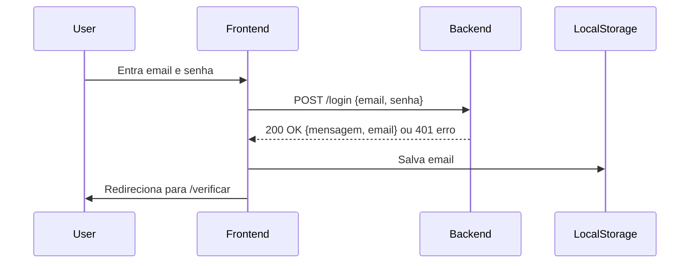
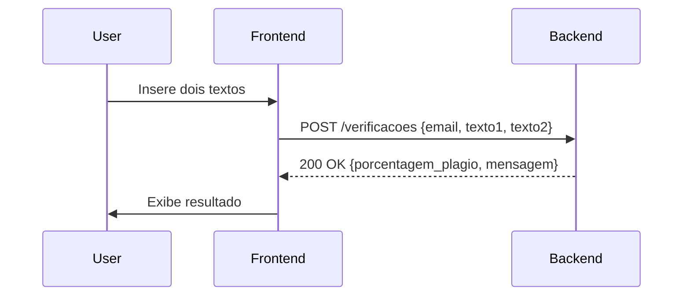
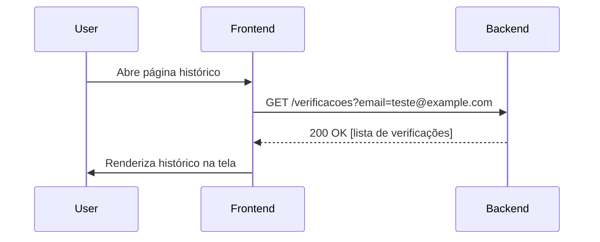
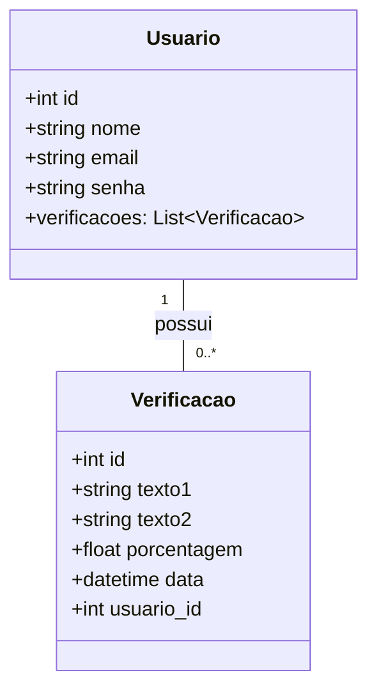

# Documentação da Comunicação entre Módulos do Sistema
## Visão Geral
O sistema possui dois módulos principais que se comunicam via API RESTful:
- Backend (Flask): API que gerencia autenticação, verificações de plágio, persistência de dados.
- Frontend (HTML, JavaScript, TailwindCSS): interface para o usuário interagir, enviar dados e visualizar resultados.
A comunicação é feita por requisições HTTP, com dados enviados e recebidos em JSON.

## Módulos e Responsabilidades
### Backend
- Oferece endpoints REST:
  - POST /login
  - POST /verificacoes
  - GET /verificacoes?email=...
  - GET /verificar e GET /historico para páginas HTML
- Armazena dados no banco SQLite via SQLAlchemy.
- Valida entrada e retorna respostas HTTP apropriadas.

### Frontend
- Páginas:
  - index.html (Login)
  - verificar.html (Formulário de verificação)
  - historico.html (Lista de verificações)
- Usa fetch() para consumir API backend.
- Mantém o email do usuário em localStorage para sessão simples.

## Fluxos de Comunicação
### 1. Login

Exemplo requisição:
```
POST /login
Content-Type: application/json
{
  "email": "teste@example.com",
  "senha": "123456"
}
```
Resposta sucesso:
```
HTTP/1.1 200 OK
{
  "mensagem": "Login bem-sucedido",
  "email": "teste@example.com"
}
```
Resposta erro:
```
HTTP/1.1 401 Unauthorized
{
  "erro": "Email ou senha inválidos"
}
```

### 2. Verificação de Plágio

Exemplo requisição:
```
POST /verificacoes
Content-Type: application/json
{
  "email": "teste@example.com",
  "texto1": "Texto produzido pelo usuário.",
  "texto2": "Texto para comparação."
}
```
Resposta:
```
HTTP/1.1 200 OK
{
  "porcentagem_plagio": 75.34,
  "mensagem": "Verificação concluída."
}
```

### 3. Consulta ao Histórico de Verificações

Exemplo requisição:
```
GET /verificacoes?email=teste@example.com
```
Resposta:
```
HTTP/1.1 200 OK
[
  {
    "texto1": "Texto A",
    "texto2": "Texto B",
    "porcentagem": 80.5,
    "data": "2025-06-20T18:00:00"
  },
  {
    "texto1": "Outro texto A",
    "texto2": "Outro texto B",
    "porcentagem": 45.2,
    "data": "2025-06-19T15:30:00"
  }
]
```

### 4. Logout
Frontend limpa localStorage e redireciona para a página de login.

## Modelo de Dados (Resumo)


## Considerações Técnicas
- O backend usa CORS para permitir requisições do frontend.
- A comunicação utiliza JSON para padronização.
- As rotas retornam códigos HTTP corretos para facilitar tratamento no frontend.
- O frontend usa armazenamento local para sessão simples.
- O backend utiliza Flask com SQLAlchemy e SQLite para persistência.
