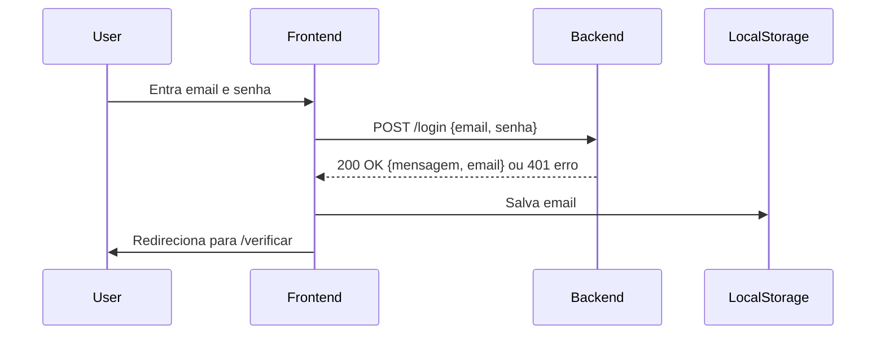
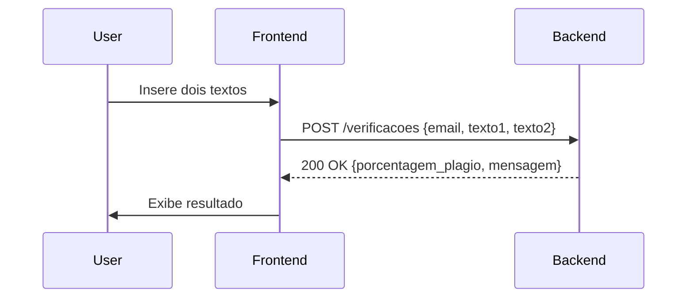
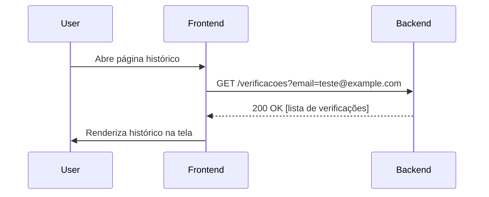
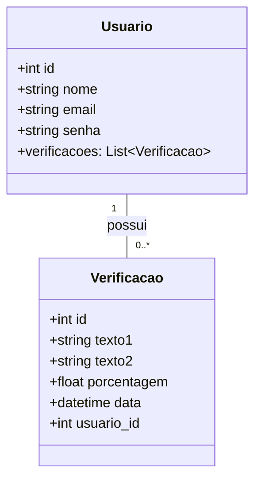
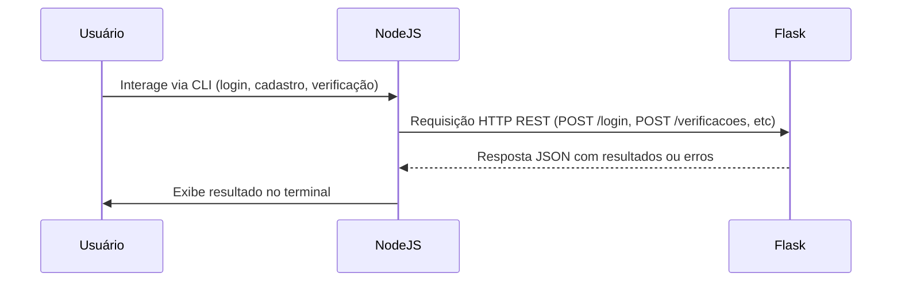

# Documentação do Projeto: Comunicação entre Aplicações Flask e Node.js

---

## Resumo do Projeto

Este projeto consiste em duas aplicações separadas: uma backend em Flask que expõe uma API RESTful para executar funções em Python (como verificação de plágio) e uma aplicação cliente em Node.js que consome essa API via chamadas HTTP. O Node.js não executa código Python diretamente, apenas solicita que o Flask execute e retorne os resultados. A comunicação entre elas é feita exclusivamente por REST, com dados trocados em JSON. A documentação detalha essa comunicação e as funcionalidades de cada módulo.

---

## Requisito da Tarefa

A tarefa exige o desenvolvimento de duas aplicações distintas:

1. **Aplicação Flask (Python)**  
   - Responsável por fornecer uma API RESTful.  
   - Executa a lógica principal em Python, como autenticação, verificação de plágio e armazenamento dos dados no banco.  
   - Expõe endpoints HTTP para receber requisições e retornar respostas em JSON.

2. **Aplicação Node.js (JavaScript)**  
   - Atua como cliente dessa API RESTful.  
   - Faz requisições HTTP para o backend Flask para solicitar a execução de código Python (ex: verificação de plágio).  
   - Processa e apresenta os resultados ao usuário (no caso atual, via terminal CLI).

3. **Comunicação via REST**  
   - O Node.js e o Flask se comunicam exclusivamente por meio de requisições HTTP REST.  
   - O Node.js não executa lógica Python diretamente, mas solicita ao Flask que execute e retorne resultados.

---

## Visão Geral

O sistema possui dois módulos principais que se comunicam via API RESTful:

- **Backend (Flask):** API que gerencia autenticação, verificações de plágio, persistência de dados.  
- **Frontend (HTML, JavaScript, TailwindCSS):** interface para o usuário interagir, enviar dados e visualizar resultados.

A comunicação é feita por requisições HTTP, com dados enviados e recebidos em JSON.

---

## Módulos e Responsabilidades

### Backend
- Oferece endpoints REST:
  - `POST /login`
  - `POST /verificacoes`
  - `GET /verificacoes?email=...`
  - `GET /verificar` e `GET /historico` para páginas HTML
- Armazena dados no banco SQLite via SQLAlchemy.
- Valida entrada e retorna respostas HTTP apropriadas.

### Frontend
- Páginas:
  - `index.html` (Login)
  - `verificar.html` (Formulário de verificação)
  - `historico.html` (Lista de verificações)
- Usa `fetch()` para consumir API backend.
- Mantém o email do usuário em `localStorage` para sessão simples.

---

## Fluxos de Comunicação

### 1. Login


**Exemplo requisição:**
```http
POST /login
Content-Type: application/json

{
  "email": "teste@example.com",
  "senha": "123456"
}
```
**Resposta sucesso:**
```http
HTTP/1.1 200 OK
{
  "mensagem": "Login bem-sucedido",
  "email": "teste@example.com"
}
```
**Resposta erro:**
```http
HTTP/1.1 401 Unauthorized
{
  "erro": "Email ou senha inválidos"
}
```

---

### 2. Verificação de Plágio


**Exemplo requisição:**
```http
POST /verificacoes
Content-Type: application/json

{
  "email": "teste@example.com",
  "texto1": "Texto produzido pelo usuário.",
  "texto2": "Texto para comparação."
}
```
**Resposta:**
```http
HTTP/1.1 200 OK
{
  "porcentagem_plagio": 75.34,
  "mensagem": "Verificação concluída."
}
```

---

### 3. Consulta ao Histórico de Verificações


**Exemplo requisição:** 
```http
GET /verificacoes?email=teste@example.com
```
**Resposta:**
```json
[
  {
    "texto1": "Texto A",
    "texto2": "Texto B",
    "porcentagem": 80.5,
    "data": "2025-06-20T18:00:00"
  },
  {
    "texto1": "Outro texto A",
    "texto2": "Outro texto B",
    "porcentagem": 45.2,
    "data": "2025-06-19T15:30:00"
  }
]
```

---

### 4. Logout

- Frontend limpa `localStorage` e redireciona para a página de login.

---

## Modelo de Dados (Resumo)



---

## Como o Node.js Está Funcionando na Aplicação

- O Node.js funciona como uma **interface de linha de comando (CLI)** para o usuário.  
- Possui menus para:  
  - Fazer login no sistema (`/login` no Flask).  
  - Cadastrar novo usuário (`/usuarios` no Flask).  
  - Solicitar verificação de plágio (`/verificacoes` no Flask).  
- Cada ação dispara uma requisição HTTP para a API Flask, que processa e retorna respostas JSON.  
- O Node.js interpreta essas respostas e exibe mensagens no terminal.  
- A autenticação gera um token (simulado) para manter sessão no Node.js.  
- **Para iniciar o Node.js, execute no terminal:**  
  ```
  node app.js
  ```

---

## Relação entre as Aplicações e Fluxo



# Explicação do Menu CLI em Node.js

Este script implementa uma interface de linha de comando (CLI) que interage com uma API REST usando Node.js. Ele usa os módulos:

- **`readline`**: para interação via terminal (entrada e saída).
- **`axios`**: para fazer requisições HTTP ao backend.

---

## Funcionamento Geral

1. **Menu Principal**  
   Apresenta opções para o usuário:  
   - Fazer Login  
   - Cadastrar Usuário  
   - Sair  

2. **Menu Logado**  
   Após login bem-sucedido, apresenta opções:  
   - Verificar Plágio  
   - Logout  

3. **Fluxo de Requisições**  
   Cada opção selecionada no menu realiza uma chamada HTTP para o backend:  
   - Login: POST `/login`  
   - Cadastro: POST `/usuarios`  
   - Verificação de Plágio: POST `/plagio`  

---

## Fluxo do Menu - Diagrama

```mermaid
stateDiagram-v2
    [*] --> MenuPrincipal

    MenuPrincipal --> FazerLogin : Opção 1
    MenuPrincipal --> CadastrarUsuario : Opção 2
    MenuPrincipal --> [*] : Opção 0 (Sair)

    FazerLogin --> MenuLogado : Login OK
    FazerLogin --> MenuPrincipal : Login falhou

    CadastrarUsuario --> MenuPrincipal : Cadastro finalizado

    MenuLogado --> VerificarPlagio : Opção 1
    MenuLogado --> MenuPrincipal : Logout (Opção 2)

    VerificarPlagio --> MenuLogado : Após verificação
---

## Considerações Técnicas

- O backend usa CORS para permitir requisições do frontend.  
- A comunicação utiliza JSON para padronização.  
- As rotas retornam códigos HTTP corretos para facilitar tratamento no frontend.  
- O frontend usa armazenamento local para sessão simples.  
- O backend utiliza Flask com SQLAlchemy e SQLite para persistência.
